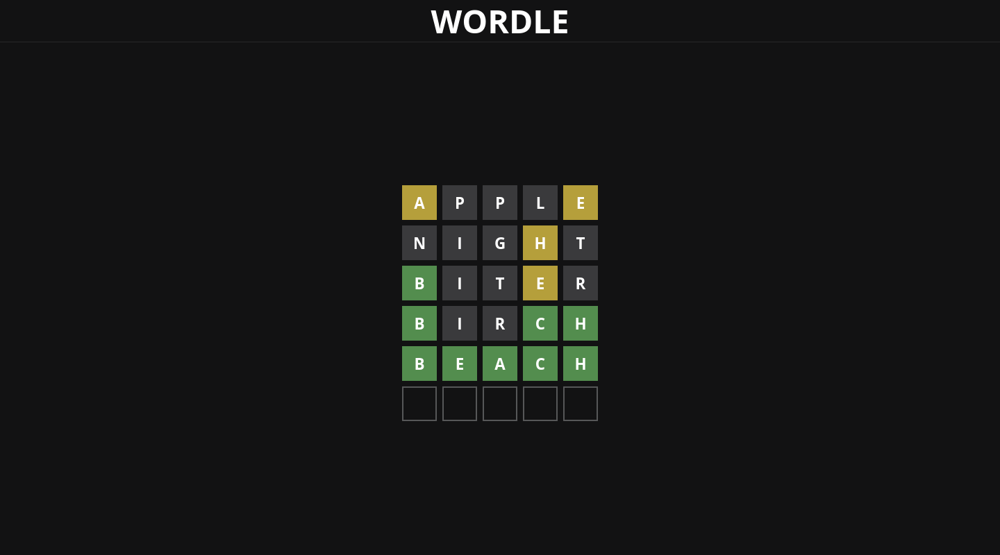

<div id="top"></div>

# wordle-game
A clone of the wordle game built with HTML, CSS and Javascript

### Built with:
   



[Live Preview](https://wordle-game-josneth.netlify.app/)


## Dependencies

Install NPM or PNPM
* npm
  ```sh
  npm install npm@latest -g
  ```
 
  Or
  
* pnpm
  ```sh
  npm install -g pnpm
  ```


## Setup

1. Clone the repo
   ```sh
   git clone https://github.com/josnethmoreno/wordle-game.git
   ```
   
2. Install NPM packages
   ```sh
   npm install
   ```
   
3. Start the development server
   ```sh
   npm run dev
   ```


## Build & deploy

1. Generate a full static production build
   ```sh
   npm run build
   ```
   
2. Preview the site as it will appear once deployed
   ```sh
   npm run preview
   ```

## License

Distributed under the MIT License. See `LICENSE.txt` for more information.

<p align="right">(<a href="#top">back to top</a>)</p>